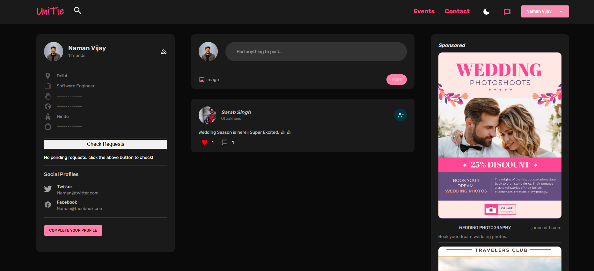

# UniTie Matrimony Social Media App

UniTie is a comprehensive social media matrimony website built using the MERN stack (MongoDB, Express.js, React.js, Node.js), designed to provide users with a holistic platform that goes beyond traditional matchmaking. The website integrates social media features with matrimony services, allowing users to connect, interact, and plan their future with various tools and features. 

## Features

- User authentication and authorization with Google OAuth 2.0.
- User profile creation and editing.
- All Social Media features: Post, Comment, Like, Delete, Send Friend Request.
- Real-time chat feature to communicate with matches.
- Responsive UI for seamless use on both desktop and mobile devices.

## Snapshots

- Main Page  

- Home Page  

- Like Comment  

- Search Feature  

- SendFriendRequest  

- Accept/Reject FriendRequest  

- Dark Mode  

- Payment Gateway for subscriptions  

## License

[MIT License](https://opensource.org/licenses/MIT) 

## Contact

If you have any questions or concerns about UniTie, please contact us at namanvijay814@gmail.com.
