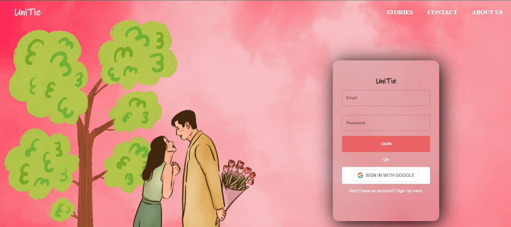
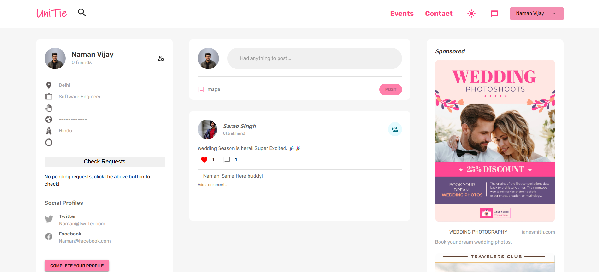
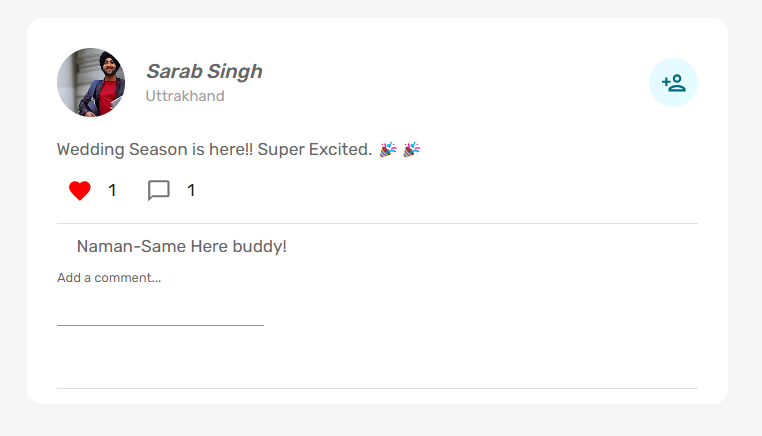
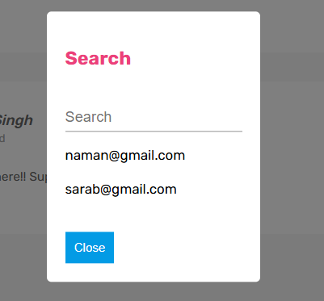
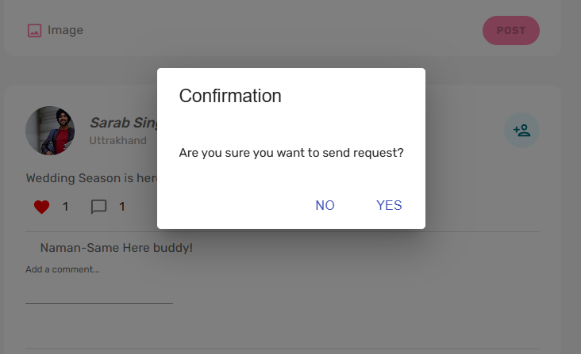
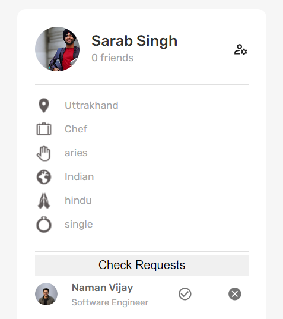
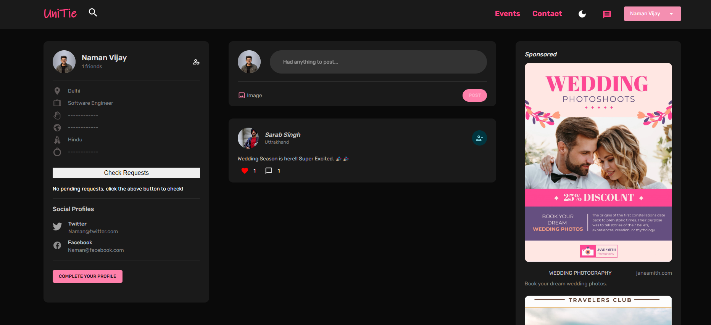
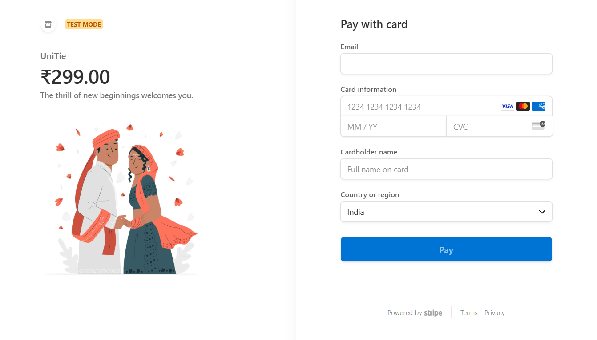

# UniTie Matrimony Social Media App

UniTie is a comprehensive social media matrimony website built using the MERN stack (MongoDB, Express.js, React.js, Node.js), designed to provide users with a holistic platform that goes beyond traditional matchmaking. The website integrates social media features with matrimony services, allowing users to connect, interact, and plan their future with various tools and features. 

## Features

- User authentication and authorization with Google OAuth 2.0.
- User profile creation and editing.
- All Social Media features: Post, Comment, Like, Delete, Send Friend Request.
- Real-time chat feature to communicate with matches.
- Responsive UI for seamless use on both desktop and mobile devices.

## Snapshots

- Main Page

- Home Page

- Like Comment 

- Search Feature

- SendFriendRequest 

- Accept/Reject FriendRequest

- Dark Mode

- Payment Gateway for subscriptions



## Installation

To run UniTie on your local machine, follow these steps:

1. Clone the repository: `git clone https://github.com/your-username/UniTie.git`
2. Change into the project directory: `cd UniTie`
3. Install the server dependencies: `npm install`
4. Change into the client directory: `cd client`
5. Install the client dependencies: `npm install`
6. Change back into the project directory: `cd ..`
7. Create a `.env` file in the project root and add the following variables:
    ```
    MONGO_URI=<your-mongodb-uri>
    SESSION_SECRET=<your-session-secret>
    GOOGLE_CLIENT_ID=<your-google-client-id>
    GOOGLE_CLIENT_SECRET=<your-google-client-secret>
    ```
8. Start the server: `npm run start`
9. Start the client: `npm run client`

Note: You will need to have a MongoDB Atlas account and a Google Cloud Platform project set up to use the app's authentication features.

## Usage

Once the app is running, you can access it by navigating to `http://localhost:3000` in your web browser. From there, you can create an account or log in with your Google account. 

## Contributing

If you want to contribute to UniTie, please follow these steps:

1. Fork the repository.
2. Create a new branch: `git checkout -b my-new-feature`
3. Make changes and commit them: `git commit -am 'Add some feature'`
4. Push to the branch: `git push origin my-new-feature`
5. Create a pull request.

## Credits

This app was built by Naman.

## License

[MIT License](https://opensource.org/licenses/MIT) 

## Contact

If you have any questions or concerns about UniTie, please contact us at namanvijay814@gmail.com.
